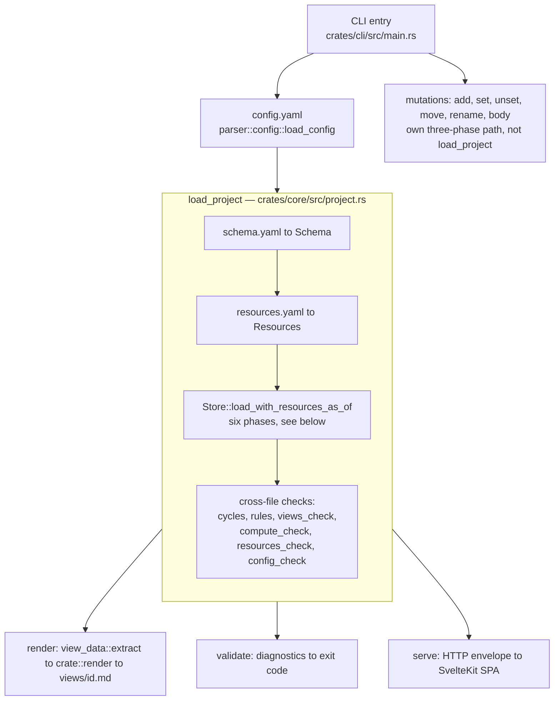

# Architecture: how work flows through workdown

For contributors. This page is the map between the stages — the order they run in, and what each one hands to the next. It is not a substitute for the module headers: each stage's own `//!` docs explain what happens *inside* it, and this page links to them rather than repeating them.

Two conventions keep it from going stale:

- **The page owns the gaps, modules own the stages.** A fact about the order of two stages, or about what crosses the boundary between them, belongs here — no single module can state it. A fact about what a stage does internally belongs to that module's header.
- **Links name files and symbols, never line numbers.** `Store::load_with_resources_as_of` in `crates/core/src/store/mod.rs`, not a line number that shifts under the next refactor.

## The shape of the system

Every command shares one spine — read the project into memory — and then branches into one of four exits. The spine is the expensive-to-discover part; if you are debugging `serve`, the first two thirds of this page still apply to you.

## The spine

### Entry, and the one thing read outside the loader

`crates/cli/src/main.rs` parses arguments with clap, then `run` dispatches. Two facts about that function are contracts rather than implementation detail:

- **`config.yaml` is read once, in the dispatcher, not per command.** Every arm but `init` opens with `load_project_config`; `init` is the exception because producing a config is its job.
- **The current directory is read once, at the top.** Every command works relative to where it was invoked, so no command re-derives the project root.

Failures leave through one channel: `run` returns `anyhow::Result<ExitCode>`, and `main` routes any `Err` to `cli::output::error`. Routing a startup failure through `tracing` instead would both look different from an operation failure and be subject to the log filter, which can drop it entirely.

`workdown add` is the one command with two-phase argument parsing: the top-level parse captures raw args, then the schema is loaded and a second `clap::Command` is built with one flag per schema field (`cli::schema_args::build_add_command`). That is why `workdown add --help` only lists real fields when run inside a project.

### `load_project` — the shared loader

`crate::project::load_project` is what `render`, `validate` and `serve` all call. It takes an already-parsed `Config` plus the path it was read from, and returns one `Project` holding the store, schema, views, resources, calendar, evaluation date, and every diagnostic collected on the way.

Four ordering decisions inside it are contracts, not incidental:

1. **The evaluation date is resolved first, exactly once, and threaded down as a parameter.** `--as-of` overrides it; `None` means the current local date. Nothing below this line reads the clock — `Store::load_with_resources_as_of` takes the date as an argument precisely so a pinned run is reproducible. See [ADR-010](adr/010-evaluation-date.md).
2. **`resources.yaml` loads before the store**, because compute expressions resolve `$constants.<name>` during the store's derive phase. A missing file is fine; a malformed one becomes a diagnostic rather than a hard failure.
3. **`views.yaml` is parsed exactly once.** `views_check::load_and_check` returns the parsed views *and* its diagnostics together, so nothing re-reads the file to populate `Project::views`.
4. **Only schema and items-directory failures are hard.** Everything else — unparseable views, broken resources, a bad display default — rides along as a diagnostic inside a successful `Project`, so the server can still answer with a banner instead of a blank page. `LoadError::to_diagnostic` converts the two hard failures into the same diagnostic shape, so a front end has one channel to render, not two.

### `Store::load` — six phases and one contract

The store's own module header lists the phases and the reason for their order; read it there. What matters at this altitude is the single contract that order encodes:

> A check that judges a field's **final** value runs after the fill-in phase. Anything earlier may only judge what was **literally written**.

That is why coercion (phase 2) reports type mismatches but never absence, while the required check (phase 5) and the `resource:` check (phase 6) sit on the far side of derivation — a derived value is held to the same standard as a hand-written one, and no check has to predict what a mechanism would have produced. See [ADR-012](adr/012-validation-after-derivation.md).

One record crosses that boundary, and it is easy to miss. Coercion *drops* values that failed conversion, so a later phase could not otherwise tell *written but invalid* from *never written*. It therefore hands forward a list of conversion failures. Derivation reads it — a broken hand-written value is never silently replaced by a derived one — and so does the required check.

The fill-in phase itself (compute, conditions, pulls, aggregate rollups) is one dependency graph over `(item, field)` pairs, not a series of per-mechanism passes. Its scheduling rules live in `crates/core/src/store/derive.rs`; [ADR-011](adr/011-pull-fields-and-derive-graph.md) records why it is one graph.

### Where the checks live, and why they are split

Checks are not all in one place. The split follows what each one needs in hand:

| Check | Runs | Because |
|---|---|---|
| coercion, id uniqueness, broken links | inside `Store::load` | needs only the schema and the raw items |
| required fields, `resource:` values | inside `Store::load`, after derive | judges final values ([ADR-012](adr/012-validation-after-derivation.md)) |
| link cycles, rules | in `load_project`, on the loaded store | needs the whole item graph |
| `views_check` | in `load_project` | needs schema, store and resources together |
| `compute_check`, `resources_check` | in `load_project` | needs schema **and** resources (constant types), which schema parsing alone does not have |
| `config_check` | in `load_project` | validates `config.yaml`'s display defaults against the schema |

`compute_check` is the one that appears twice, and the pairing is deliberate. `compute_check::failed_fields` runs *inside* the store's derive phase to skip fields whose config is broken; `compute_check::evaluate` runs at project level to *report* them. The effect is that a broken compute expression produces exactly one diagnostic against `schema.yaml`, not one per item that would have used it.

Every finding is a scope-typed `Diagnostic` — file, item, config or collection — rather than a string ([ADR-007](adr/007-diagnostic-scope-typing.md)). That typing is what lets the CLI group findings by file and the web UI pin them to the right banner without parsing text.

## The four exits

### `workdown render` — Markdown files

`crates/cli/src/commands/render.rs` orchestrates; `crates/cli/src/render/` formats. Three hand-offs here are worth knowing:

- **Display defaults are applied after validation.** `Views::with_display_defaults` fills unset roles from `defaults.display` in `config.yaml` *after* `views_check` has run, so diagnostics keep pointing at what the user actually wrote in `views.yaml`. The full precedence ladder is [ADR-008](adr/008-display-configuration.md).
- **Extraction cannot be reached without validation.** `view_data::extract` takes a `CheckedView`, not a bare `View` — the type carries the precondition, so a caller cannot skip the check and then trip a panic inside an extractor. A view with an *error*-severity finding is skipped with a warning; a warning-severity finding still renders.
- **`ViewData` owns structure and order; renderers own wording and color.** That dividing line is [ADR-006](adr/006-visualization-architecture.md), and it is why there is exactly one extractor per view kind but two renderers (Markdown here, Svelte components in the UI). If you find yourself sorting inside a renderer, it belongs in the extractor.

When any computed field reads `$today`, the command says so on stderr: the output is then a function of the calendar, not only of the repository, and a surprising diff on an untouched repo deserves its explanation attached.

### `workdown validate` — diagnostics and an exit code

`crate::operations::validate::validate` is a thin wrapper over `load_project` that adds the `has_errors` flag. It exists so the exit-code rule lives in one place: errors fail the run, warnings do not. Per [ADR-001](adr/001-snapshot-validation.md), validation judges the current snapshot only — never git history, never state transitions.

### `workdown serve` — HTTP, then the SPA

The CLI's `serve` command wires up `workdown-server`, which is library-shaped: `router`, `bind`, `serve`, with no `main` and no flag parsing. Its router has two layers — the `/api/*` tree, and a fallback serving the embedded SvelteKit bundle.

The hand-offs across the wire:

- **The project is loaded per request.** No cache, cold-load every time. Parsing a few hundred items takes milliseconds, well under human-perceptible latency, and it means there is no stale-cache class of bug at all. A deliberate trade, revisited only when it starts to hurt.
- **One envelope, three failure tiers.** Every endpoint answers `{ data, diagnostics, error }`; `diagnostics` is always present, often empty, so the client never optional-chains it. The tiers — project will not load (422), project loaded but this view will not render (200 with no data), success (200) — are identical across the view, schema, item and timer handlers. [ADR-013](adr/013-web-layer-contract.md) has the full contract; `crates/server/src/envelope.rs` is the code.
- **The server is view-kind-agnostic.** It serializes whatever `ViewData` the extractor produced. Per-kind knowledge lives at the extractor and at the two renderers, never in between — which is why adding a view kind needs no server change at all.
- **Types are generated, not hand-written.** `cargo xtask gen-types` runs `crates/core/examples/gen_types.rs`, which emits `ui/src/lib/api/generated/*.ts` from the `TS` derives on the wire types. Transitive dependencies need their own `exports.add::<T>()` line — ts-rs does not surface them when we drive the writes ourselves. Those calls are the only list: collection completes before any file is written, so each file's `import type` lines resolve against the set actually exported.
- **The browser learns about changes by ping, not by payload.** `crates/server/src/watcher.rs` debounces filesystem events into one broadcast ping per settled burst, and the SSE handler forwards it. Because there is no cache, the ping invalidates nothing; it only tells the browser to ask again.

On the client side, `ui/src/lib/api/client.ts` unwraps the envelope once for every call site, and `ui/src/lib/views/ViewRenderer.svelte` dispatches a `ViewData` payload to the matching per-kind component.

### Mutations — the file, then a reload

`add`, `set`, `unset`, `move`, `rename` and `body` do **not** go through `load_project`. They share the three-phase shape of `crate::operations::set::run_set`:

1. **Pre-flight** — load schema and store, validate the id and field, read the target file, capture the pre-mutation diagnostics. Hard errors here never touch disk.
2. **Compute** — build the new frontmatter map, and decide whether a write is needed at all.
3. **Finalize** — atomic write, reload, diff the diagnostics.

The diff is the interesting part, and it implements [ADR-001](adr/001-snapshot-validation.md)'s save-with-warning rule: a schema violation does not block the save. Any diagnostic present *after* the mutation but not before flips `mutation_caused_warning`, and that flag — not severity, not scope — drives the exit code. Writing an invalid value warns you and saves; leaving an already-invalid value untouched stays quiet.

Frontmatter is rendered by `crate::operations::frontmatter_io::build_frontmatter_yaml`, which emits schema-defined fields in schema order and unknown fields alphabetically after them. Deterministic ordering is what keeps mutations producing clean diffs.

## Adding a view kind

Thirteen kinds exist today. A fourteenth touches the places below. The right-hand column is what stops you shipping it half-done — and the rows reading **nothing** are the backlog `view-kind-sync-guards` closes.

| # | Touchpoint | Enforced by |
|---|---|---|
| 1 | `ViewKind` and `ViewType` — `crates/core/src/model/views.rs` | compiler (the enum everything else matches on) |
| 2 | `RawView` slot and `convert_view` — `crates/core/src/parser/views.rs` | compiler |
| 3 | Slot and type rules — `crates/core/src/views_check.rs` | compiler (exhaustive match on `ViewKind`) |
| 4 | Extractor module plus `ViewData` variant — `crates/core/src/view_data/` | compiler |
| 5 | Markdown renderer — `crates/cli/src/render/`, dispatched by `render_view_data` and counted by `emit_unplaced_warnings` in `crates/cli/src/commands/render.rs` | compiler (both matches are exhaustive) |
| 6 | View subtitle — `crates/cli/src/render/description.rs` | compiler |
| 7 | Wire types — one `exports.add::<T>()` line per new struct in `crates/core/examples/gen_types.rs`, then `cargo xtask gen-types` | the UI type check, indirectly — a forgotten type has no `.ts` file, so `npm run check` fails on the dangling import in whatever references it |
| 8 | `crates/core/defaults/views.schema.json` (editor autocomplete) | **partial** — `crates/core/tests/views_schema.rs` checks shapes against two "all view types" fixtures that each cover 12 of the 13 kinds (`gantt_by_depth` is missing from both); nothing asserts that the `type` values the schema accepts equal the enum |
| 9 | `VIEW_KIND_CONTROLS` — `ui/src/lib/views/viewKinds.ts` | TypeScript: `Record<ViewType, …>` is exhaustive over the generated union — but only once step 7 has regenerated `ViewType` |
| 10 | `VIEW_KINDS`, the ordered picker list in the same file | **nothing** — a plain `ViewType[]`, and the `toHaveLength(13)` assertion in `viewKinds.test.ts` still passes with a kind missing |
| 11 | The accepted-type lists in the same file, mirroring `views_check` | **nothing** — the server re-validates, so drift is a UX gap rather than a corrupt write, but it is still drift |
| 12 | Component plus branch in `ui/src/lib/views/ViewRenderer.svelte` | **nothing at build time** — the `{:else}` branch surfaces the unknown kind at runtime |
| 13 | The view-kind table in [docs/views.md](views.md) | **nothing** |
| 14 | Recording-dot support, if the kind presents items: compare each item against `timerStore.runningItemId` | **nothing**, and it is reimplemented independently in six components today (board `Card`, `GanttChart`, `GraphView`, `TableView`, `TreeNode`, `TreemapView`). A new kind has to copy it — that duplication is a standing extraction candidate, not a pattern to endorse |

**No change needed** in `crates/server`, which serializes `ViewData` and knows nothing about kinds, nor anywhere in the load spine (store, derive, checks).

A workable order: 1–6 in one pass, leaning on `cargo check` to walk you through the exhaustive matches; then 7 to regenerate types; then 9–12 under `npm run check`; then 8 and 13, which nothing will remind you about.

## Related reading

- [Schema guide](schema.md) — field types, validation rules, defaults, computed, aggregated and pull fields.
- [Views guide](views.md) — every view kind and its options.
- [Architecture Decision Records](adr/) — the *why* behind the decisions this page describes the *what* of.
