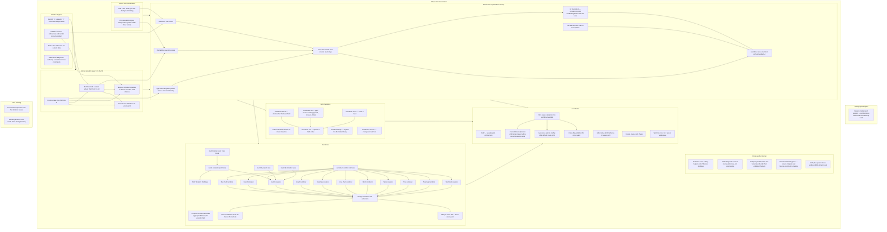

# Graph: depends_on

Directed graph of items connected through `depends_on`, nested by `parent`.

```mermaid
flowchart TD
    subgraph multi-project-support ["Multi-project support"]
        multi-project-design["Design multi-project support — set decisions and break out follow-up work"]
    end
    subgraph phase-04-visualization ["Phase 04: Visualization"]
        subgraph code-quality ["Code-quality cleanup"]
            cross-cutting-helpers["Relocate cross-cutting helpers out of feature modules"]
            diagnostic-scope-routing["Make diagnostic source-routing structural, not enumerative"]
            diagnostic-variant-cleanup["Collapse parallel View* slot variants and unify their validation helpers"]
            render-module-hygiene["Render module hygiene — escape helpers, test fixtures, common.rs naming"]
            walker-primitives["Unify the upward chain walks and link-target reads"]
        end
        subgraph foundation ["Foundation"]
            adr-phase-04-architecture["ADR — visualization architecture"]
            foundation-cleanup["Consolidate duplication and tighten types before more foundation work"]
            views-config-path["Add views path to config; ship default views.yaml"]
            views-cross-file-validation["Cross-file validation for views.yaml"]
            views-json-schema["Editor-only JSON Schema for views.yaml"]
            views-validate-integration["Wire views validation into workdown validate"]
            views-yaml-design["Design views.yaml shape"]
            workspace-refactor["Split into core / cli / server workspace"]
        end
        subgraph item-mutations ["Item mutations"]
            cli-add-audit["Audit workdown add for UI-driven creation"]
            cli-body-command["workdown body — replace the Markdown body"]
            cli-move-command["workdown move — shortcut for the board field"]
            cli-rename-command["workdown rename — change an item's id"]
            cli-set-command["workdown set — replace a field value"]
            cli-set-modes["workdown set — type-aware modes (append, remove, delta)"]
            cli-unset-command["workdown unset — clear a field"]
        end
        subgraph polish ["Polish & dogfood"]
            explicit-in-operator["Explicit `in` operator; `=` becomes always-literal"]
            resource-option-lists["Validate resource references and render resource pickers"]
            rules-current-date-reference["Rules can't reference the current date"]
            store-diagnostics-consistency["Make store-diagnostic surfacing consistent across commands"]
        end
        subgraph renderers ["Renderers"]
            aggregate-rollup["Compute schema-declared aggregate fields up the parent chain"]
            duration-field-type["Add `duration` field type"]
            field-value-native-date["Store FieldValue::Date as chrono::NaiveDate"]
            gantt-duration-mode["Gantt duration input mode"]
            gantt-predecessor-mode["Gantt predecessor input mode"]
            render-bar-chart["Bar chart renderer"]
            render-board["Board renderer"]
            render-command["workdown render command"]
            render-gantt["Gantt renderer"]
            render-gantt-by-depth["Gantt by depth view"]
            render-gantt-by-initiative["Gantt by initiative view"]
            render-graph["Graph renderer"]
            render-heatmap["Heatmap renderer"]
            render-line-chart["Line chart renderer"]
            render-metric["Metric renderer"]
            render-table["Table renderer"]
            render-tree["Tree renderer"]
            render-treemap["Treemap renderer"]
            render-workload["Workload renderer"]
            view-data-intermediate["Design ViewData and extractors"]
            views-title-slot["Add per-view `title:` slot to views.yaml"]
        end
        subgraph server ["Interactive UI (workdown serve)"]
            app-shell-navigation["App shell navigation (views menu + future link slots)"]
            first-view-end-to-end["First view end-to-end (board, read-only)"]
            live-updates["File watcher and SSE for live updates"]
            mutations-slice["Mutations end-to-end"]
            remaining-read-views["Remaining read-only views"]
            ui-foundation["UI foundation — conventions and scaffolding before the first view"]
            walking-skeleton["workdown serve skeleton with embedded UI"]
        end
        subgraph view-authoring ["Author and edit views from the UI"]
            schema-metadata-api["Expose schema metadata so the UI can offer valid choices"]
            view-creation["Create a new view from the UI"]
            view-filter-editor["Build and edit a view's where filter from the UI"]
            view-write-backend["Persist view definitions to views.yaml"]
        end
        subgraph view-presentation ["View & item presentation"]
            color-field-type["Add `color` field type with background tinting"]
            view-display-config["Per-view-kind display configuration (which fields show where)"]
        end
    end
    subgraph time-tracking ["Time tracking"]
        duration-comparison-rule["Cross-field comparison rule for duration values"]
        git-derived-default-generator["Default generator that reads dates from git history"]
    end
    app-shell-navigation --> first-view-end-to-end
    cli-move-command --> cli-set-command
    cli-set-modes --> cli-set-command
    cli-unset-command --> cli-set-command
    color-field-type --> mutations-slice
    explicit-in-operator --> view-filter-editor
    first-view-end-to-end --> ui-foundation
    first-view-end-to-end --> walking-skeleton
    gantt-duration-mode --> duration-field-type
    gantt-duration-mode --> render-gantt
    gantt-predecessor-mode --> gantt-duration-mode
    item-mutations --> foundation
    live-updates --> walking-skeleton
    mutations-slice --> first-view-end-to-end
    polish --> view-authoring
    remaining-read-views --> first-view-end-to-end
    render-bar-chart --> view-data-intermediate
    render-board --> view-data-intermediate
    render-command --> render-bar-chart
    render-command --> render-board
    render-command --> render-gantt
    render-command --> render-graph
    render-command --> render-heatmap
    render-command --> render-line-chart
    render-command --> render-metric
    render-command --> render-table
    render-command --> render-tree
    render-command --> render-treemap
    render-command --> render-workload
    render-gantt --> view-data-intermediate
    render-gantt-by-depth --> render-gantt
    render-gantt-by-initiative --> render-gantt
    render-graph --> view-data-intermediate
    render-heatmap --> view-data-intermediate
    render-line-chart --> view-data-intermediate
    render-metric --> view-data-intermediate
    render-table --> view-data-intermediate
    render-tree --> view-data-intermediate
    render-treemap --> view-data-intermediate
    render-workload --> view-data-intermediate
    renderers --> foundation
    resource-option-lists --> mutations-slice
    resource-option-lists --> schema-metadata-api
    server --> foundation
    server --> item-mutations
    server --> renderers
    ui-foundation --> walking-skeleton
    view-authoring --> server
    view-creation --> app-shell-navigation
    view-creation --> schema-metadata-api
    view-creation --> view-filter-editor
    view-creation --> view-write-backend
    view-data-intermediate --> field-value-native-date
    view-data-intermediate --> views-title-slot
    view-display-config --> remaining-read-views
    view-filter-editor --> remaining-read-views
    view-filter-editor --> schema-metadata-api
    view-filter-editor --> view-write-backend
    view-presentation --> server
    views-validate-integration --> foundation-cleanup
    views-validate-integration --> views-config-path
    views-validate-integration --> views-cross-file-validation
```
