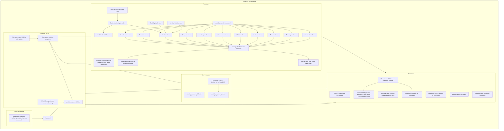

# Graph: depends_on

```mermaid
flowchart TD
    subgraph phase-04-visualization ["Phase 04: Visualization"]
        subgraph foundation ["Foundation"]
            adr-phase-04-architecture["ADR — visualization architecture"]
            foundation-cleanup["Consolidate duplication and tighten types before more foundation work"]
            views-config-path["Add views path to config; ship default views.yaml"]
            views-cross-file-validation["Cross-file validation for views.yaml"]
            views-json-schema["Editor-only JSON Schema for views.yaml"]
            views-validate-integration["Wire views validation into workdown validate"]
            views-yaml-design["Design views.yaml shape"]
            workspace-refactor["Split into core / cli / server workspace"]
        end
        frontend["Frontend"]
        subgraph item-mutations ["Item mutations"]
            cli-add-audit["Audit workdown add for UI-driven creation"]
            cli-move-command["workdown move — shortcut for the board field"]
            cli-set-command["workdown set — generic field mutation"]
        end
        subgraph polish ["Polish & dogfood"]
            store-diagnostics-consistency["Make store-diagnostic surfacing consistent across commands"]
        end
        subgraph renderers ["Renderers"]
            aggregate-rollup["Compute schema-declared aggregate fields up the parent chain"]
            duration-field-type["Add `duration` field type"]
            field-value-native-date["Store FieldValue::Date as chrono::NaiveDate"]
            gantt-duration-mode["Gantt duration input mode"]
            gantt-predecessor-mode["Gantt predecessor input mode"]
            render-bar-chart["Bar chart renderer"]
            render-board["Board renderer"]
            render-command["workdown render command"]
            render-gantt["Gantt renderer"]
            render-gantt-by-depth["Gantt by depth view"]
            render-gantt-by-initiative["Gantt by initiative view"]
            render-graph["Graph renderer"]
            render-heatmap["Heatmap renderer"]
            render-line-chart["Line chart renderer"]
            render-metric["Metric renderer"]
            render-table["Table renderer"]
            render-tree["Tree renderer"]
            render-treemap["Treemap renderer"]
            render-workload["Workload renderer"]
            view-data-intermediate["Design ViewData and extractors"]
            views-title-slot["Add per-view `title:` slot to views.yaml"]
        end
        subgraph server ["Interactive server"]
            serve-command-skeleton["workdown serve skeleton"]
            server-endpoints-and-mutations["Query and mutation endpoints"]
            server-sse-file-watching["File watcher and SSE for auto-update"]
            ui-build-integration["UI build integration and asset embedding"]
        end
    end
    cli-move-command --> cli-set-command
    frontend --> server
    gantt-duration-mode --> duration-field-type
    gantt-duration-mode --> render-gantt
    gantt-predecessor-mode --> gantt-duration-mode
    item-mutations --> foundation
    polish --> frontend
    render-bar-chart --> view-data-intermediate
    render-board --> view-data-intermediate
    render-command --> render-bar-chart
    render-command --> render-board
    render-command --> render-gantt
    render-command --> render-graph
    render-command --> render-heatmap
    render-command --> render-line-chart
    render-command --> render-metric
    render-command --> render-table
    render-command --> render-tree
    render-command --> render-treemap
    render-command --> render-workload
    render-gantt --> view-data-intermediate
    render-gantt-by-depth --> render-gantt
    render-gantt-by-initiative --> render-gantt
    render-graph --> view-data-intermediate
    render-heatmap --> view-data-intermediate
    render-line-chart --> view-data-intermediate
    render-metric --> view-data-intermediate
    render-table --> view-data-intermediate
    render-tree --> view-data-intermediate
    render-treemap --> view-data-intermediate
    render-workload --> view-data-intermediate
    renderers --> foundation
    server --> foundation
    server --> item-mutations
    server-endpoints-and-mutations --> item-mutations
    server-endpoints-and-mutations --> renderers
    server-endpoints-and-mutations --> serve-command-skeleton
    server-sse-file-watching --> server-endpoints-and-mutations
    ui-build-integration --> serve-command-skeleton
    view-data-intermediate --> field-value-native-date
    view-data-intermediate --> views-title-slot
    views-validate-integration --> foundation-cleanup
    views-validate-integration --> views-config-path
    views-validate-integration --> views-cross-file-validation
```
