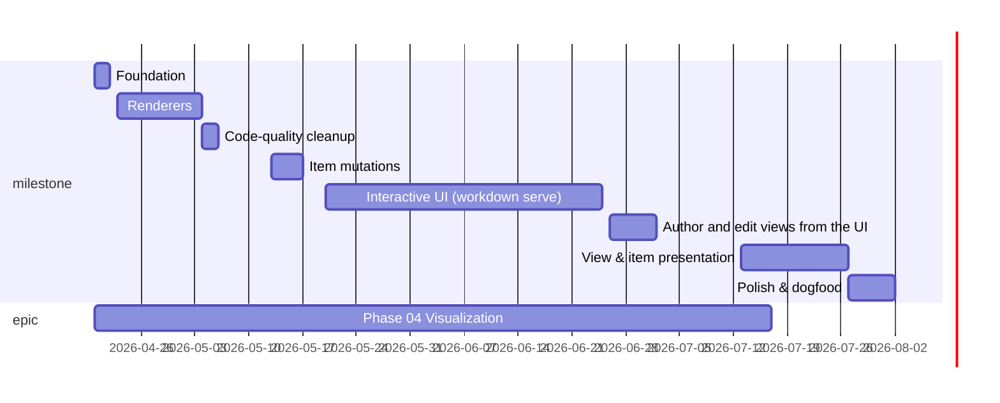

# Gantt

Timeline of items starting at `start_date` for `duration` each, grouped by `type`.

```mermaid
gantt
    dateFormat YYYY-MM-DD
    section milestone
    Foundation :foundation, 2026-04-20, 2026-04-22
    Renderers :renderers, 2026-04-23, 2026-05-04
    Code-quality cleanup :code-quality, 2026-05-04, 2026-05-06
    Item mutations :item-mutations, 2026-05-13, 2026-05-17
    Interactive UI (workdown serve) :server, 2026-05-20, 2026-06-25
    Author and edit views from the UI :view-authoring, 2026-06-26, 2026-07-02
    View & item presentation :view-presentation, 2026-07-13, 2026-07-27
    Polish & dogfood :polish, 2026-07-27, 2026-08-02
    section epic
    Phase 04 Visualization :phase-04-visualization, 2026-04-20, 2026-07-17
```

> _2 items dropped:_
> _- missing 'start_date': "Multi-project support", "Time tracking"_
