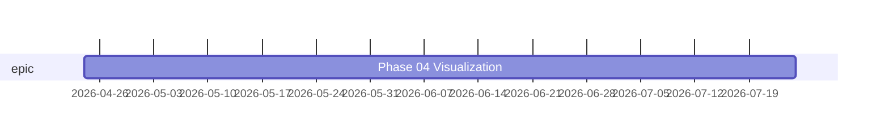

# Gantt

Timeline of items starting at `max(start_date, predecessor end)` for `duration` each; predecessors from `depends_on`, grouped by `type`.

> _8 items dropped:_
> _- no anchor: "Code-quality cleanup", "Foundation", "Multi-project support", "Time tracking"_
> _- predecessor 'foundation' unresolved: "Item mutations", "Renderers", "Interactive UI (workdown serve)"_
> _- predecessor 'frontend' unresolved: "Polish & dogfood"_
