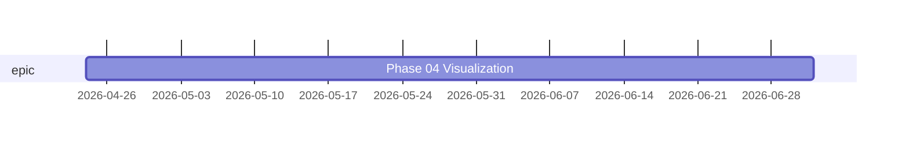

# Gantt

> _6 items dropped:_
> _- no anchor: "Foundation"_
> _- predecessor 'foundation' unresolved: "Item mutations", "Renderers", "Interactive server"_
> _- predecessor 'frontend' unresolved: "Polish & dogfood"_
> _- predecessor 'server' unresolved: "Frontend"_
