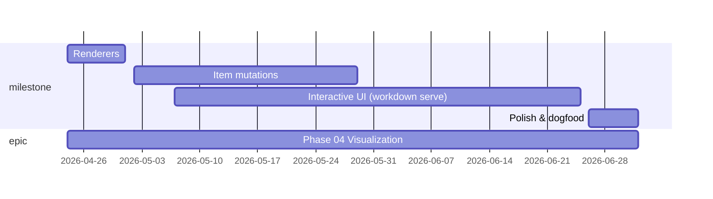

# Gantt

Timeline of items from `start_date` to `end_date`, grouped by `type`.

> _4 items dropped:_
> _- missing 'start_date': "Code-quality cleanup", "Foundation", "Multi-project support", "Time tracking"_
